  

  <h2>Fullstack developer из 🇷🇺</h2>
  

## Languages:  

 
 
 
 

  

## 💻 Tech Stack:

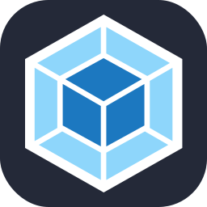

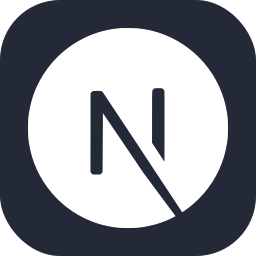
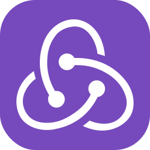
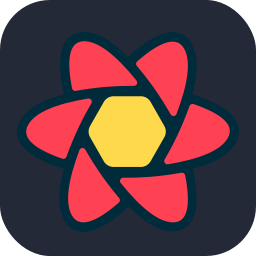
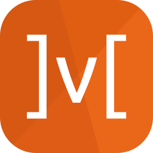
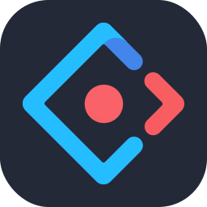
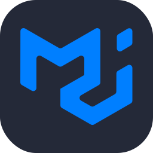

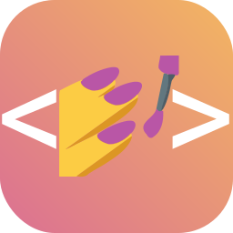

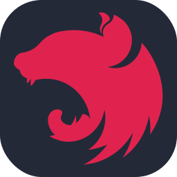

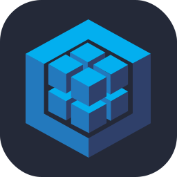

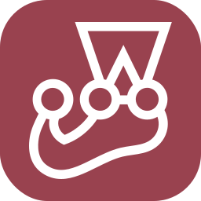

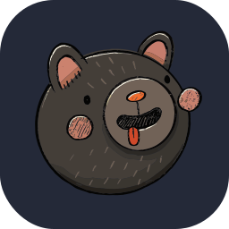

## 🛠️ My Projects:

<ul>
  <li>
    <strong>Flowmapp:</strong>  Визуальная платформа для планирования и разработки веб-дизайна. <a href="https://www.flowmapp.com/">Flowmapp.com</a> <a href="https://www.producthunt.com/products/flowmapp">Product hunt - Flowmapp</a>
  </li>
  <li>
    <strong>Vuse:</strong> Продающий сайт для вейп-бренда. <a href="https://www.vuse.ru/">Vuse</a>
  </li>
  <li>
    <strong>Санек зовет:</strong> Мобильное веб-приложение для поиска друзей. <a href="https://sanek.io/">Лэндинг</a> <a href="https://app.sanek.io/">App</a>
  </li>
    <li>
    <strong>Weams:</strong> Сервис для создания и поиска спортивных мероприятий и комьюнити. <a href="https://weams.ru/">Лэндинг</a> <a href="https://apps.apple.com/ru/app/weams-%D0%BE%D0%B1%D1%8A%D0%B5%D0%B4%D0%B8%D0%BD%D1%8F%D0%B5%D0%BC-%D1%81%D0%BF%D0%BE%D1%80%D1%82%D1%81%D0%BC%D0%B5%D0%BD%D0%BE%D0%B2/id6739068709">App</a>
  </li>
      <li>
    <strong>Cape-n-Coat:</strong> Сape&Coat — бренд верхней одежды .<a href="https://cape-n-coat.ru/">Cape-n-Coat</a>
  </li>
</ul>

# 📊 GitHub Stats:

 

### 🔝 Top Contributed Repo

