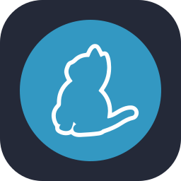

  

  <h2>Fullstack developer from St.Petersburg 🇷🇺</h2>
  

## Languages:  

 
 
 
 

  

## 💻 Tech Stack:

## 🛠️ My Projects:

| Project         | Description                                                    | Links                                                                                                                                                                                                                         |
| --------------- | -------------------------------------------------------------- | ----------------------------------------------------------------------------------------------------------------------------------------------------------------------------------------------------------------------------- |
| **dlyakojida**  | E-commerce website cosmetics stores         | [Website](https://dlyakojida.ru/)                                                                                                                       |
| **Flowmapp**    | Visual platform for web design planning and development        | [Website](https://www.flowmapp.com/) [Product Hunt](https://www.producthunt.com/products/flowmapp)                                                                                                                         |
| **Vuse**        | E-commerce website for a vape brand                            | [Website](https://www.vuse.ru/)                                                                                                                                                                                               |
| **Sanek Calls** | Mobile web application for finding friends                     | [Landing](https://sanek.io/) [Application](https://app.sanek.io/)                                                                                                                                                          |
| **Weams**       | Service for creating and finding sports events and communities | [Landing](https://weams.ru/) [App Store](https://apps.apple.com/ru/app/weams-%D0%BE%D0%B1%D1%8A%D0%B5%D0%B4%D0%B8%D0%BD%D1%8F%D0%B5%D0%BC-%D1%81%D0%BF%D0%BE%D1%80%D1%82%D1%81%D0%BC%D0%B5%D0%BD%D0%BE%D0%B2/id6739068709) |

# 📊 GitHub Stats:

 

### 🔝 Top Contributed Repo

